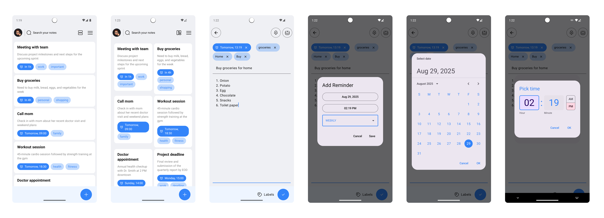

# Note App

This repository contains the source code for a comprehensive note-taking application built entirely with Kotlin and Jetpack Compose. It follows Android design and development best practices and is intended to be a useful reference for developers. The application is well-documented and follows best practices like Google's **NowInAndroid** repository for code reusability. It is also user-friendly and easy to navigate with advanced features like periodic reminder scheduling and notification management.

You can download the APK to install on your device with this link 👇

[Download APK](https://mega.nz/file/5FIhTY6Y#Azu9lq0l73xXz_jol34NXxpI88rXm0hNAXRyMg5diZU)

# Features
The application provides comprehensive note management with the following key features:

-   **Note Creation & Editing**: Create, edit, and manage notes with rich text content and titles.
-   **Label Management**: Organize notes with customizable labels for better categorization and filtering.
-   **Reminder System**: Set periodic reminders with multiple repeat intervals (daily, weekly, monthly, yearly, etc.).
-   **Smart Notifications**: Receive notifications at exact scheduled times with automatic rescheduling for recurring reminders.
-   **Persistent Scheduling**: Reminders survive device reboots and app updates through intelligent alarm management.
-   **Flexible Repeat Options**: Choose from various repeat intervals including weekdays only, weekends only, bi-weekly, quarterly, and bi-annually.

## Screenshots



# Architecture

The **Note** app follows the [official architecture guidance](https://developer.android.com/topic/architecture) and is built on **MVI** (Model-View-Intent) architecture. The Model-View-Intent architecture is a design pattern that provides several key advantages for Android app development:

## Why MVI?

**Unidirectional Data Flow**: MVI enforces a single direction of data flow, making the app's state changes predictable and easier to debug. User intents flow to the ViewModel, which updates the model, and the view reacts to state changes.

**Immutable State**: Each state is immutable, preventing accidental modifications and making the app more reliable. This is particularly important for complex features like reminder scheduling where state consistency is crucial.

**Testability**: The clear separation of concerns and predictable state management makes unit testing straightforward. Each component can be tested in isolation.

**Scalability**: As the app grows with more features (notes, labels, reminders), MVI's structure maintains code organization and prevents spaghetti code.

**Debugging**: State changes are explicit and traceable, making it easier to identify issues and understand the app's behavior.

The MVI components in our architecture:

- **Model**: Represents the application state and data (notes, labels, reminders)
- **View**: Jetpack Compose UI that observes state changes
- **Intent**: User actions that trigger state changes
- **ViewModel**: Processes intents and manages state transitions
- **Reducer**: Pure functions that define how state changes in response to intents
- **Dispatcher**: Manages side effects like database operations and alarm scheduling

## Technologies Used

-   **Kotlin** - 100% Kotlin codebase
-   **MVI Architecture** - Unidirectional data flow pattern
-   **Jetpack Compose** - Modern declarative UI toolkit
-   **Material Design 3** - Latest Material Design system
-   **Dagger/Hilt** - Dependency injection framework
-   **Room Database** - Local data persistence
-   **Kotlin Coroutines** - Asynchronous programming
-   **Kotlin Flow** - Reactive data streams
-   **AlarmManager** - System-level alarm scheduling
-   **WorkManager** - Background task management
-   **Kotlinx DateTime** - Date and time handling

# UI & Design System

The app was designed using [Material 3 guidelines](https://m3.material.io/) with a modular design system approach. The design system includes:

## Modular Design Components
- **Reusable UI Components**: Consistent buttons, text fields, dialogs, and bottom sheets
- **Theme System**: Centralized color palette, typography, and spacing tokens
- **Responsive Layouts**: Adaptive UI that works across different screen sizes
- **Accessibility**: Full support for screen readers and accessibility services

The screens and UI elements are built entirely using [Jetpack Compose](https://developer.android.com/jetpack/compose), providing smooth animations and modern user experience.

# Alarm Scheduling & Notification Management

## Smart Alarm Scheduling

The app implements a sophisticated alarm scheduling system using Android's `AlarmManager`:

- **Exact Timing**: Uses `setExactAndAllowWhileIdle()` for precise notification delivery
- **Battery Optimization**: Handles Android 12+ exact alarm permissions automatically
- **Repeat Logic**: Supports complex repeat patterns including weekdays-only and custom intervals
- **State Management**: Tracks alarm states and handles updates/cancellations efficiently

## Device Reboot Handling

The app ensures reminder persistence across device reboots through:

```kotlin
class BootReceiver : BroadcastReceiver() {
    override fun onReceive(context: Context, intent: Intent) {
        if (intent.action == Intent.ACTION_BOOT_COMPLETED) {
            // Reschedule all active reminders
            notesWithReminders.forEach { note ->
                alarmScheduler.schedule(note)
            }
        }
    }
}
```

**Key Features**:
- **Automatic Rescheduling**: All active reminders are automatically rescheduled after device restart
- **Background Processing**: Uses coroutines for efficient database queries during boot
- **State Recovery**: Maintains exact reminder times and repeat intervals

## Notification System

- **Rich Notifications**: Display note title and content in notifications
- **Auto-dismiss**: Notifications automatically dismiss after user interaction
- **Channel Management**: Proper notification channel setup for Android 8.0+
- **Priority Handling**: High-priority notifications for important reminders

# Modularization

The **Note** app follows a comprehensive modular architecture with clear separation of concerns:

## App Module
- **Single Activity Architecture**: Contains the main Activity and app-level navigation
- **Navigation Compose**: Handles screen transitions and deep linking
- **Application Class**: Manages app lifecycle and dependency injection setup

## Core Modules

### **Common Module**
- **Extension Functions**: Utility functions for date manipulation and string formatting
- **Constants**: App-wide constants and configuration values
- **Shared Resources**: Common drawables, strings, and dimensions

### **Data Module**
- **Repository Implementations**: Concrete implementations of domain repositories
- **Data Sources**: Local and remote data source abstractions
- **Service Layer**: Alarm scheduling, notification management, and background services

### **Database Module**
- **Room Database**: Local SQLite database with TypeConverters
- **DAOs**: Data Access Objects for notes, labels, and reminders
- **Migrations**: Database schema evolution management

### **Domain Module**
- **Use Cases**: Business logic encapsulation (SaveNote, ScheduleReminder, etc.)
- **Repository Interfaces**: Clean architecture data layer abstractions
- **Business Rules**: Core business logic and validation

### **Model Module**
- **Data Classes**: Immutable data structures for Note, Label, Reminder
- **Enums**: RepeatInterval, NoteStatus, and other type-safe enumerations
- **Value Objects**: Domain-specific value classes

### **Design System Module**
- **Theme Configuration**: Material 3 color schemes and typography
- **Reusable Components**: Buttons, text fields, cards, and other UI elements
- **Icons & Assets**: Centralized icon library and image resources

# Development Environment

**Note App** uses the Gradle build system with version catalogs and can be imported directly into Android Studio.

**Requirements**:
- Android Studio Hedgehog or newer
- Kotlin 1.9.0+
- Android SDK 34+
- JDK 11+

Change the run configuration to `app`.

# Build

To build and run the Note App, follow these steps:

1. **Clone the repository**:
   ```bash
   git clone https://github.com/AlirezaNezami96/NoteApp.git
   ```

2. **Open the project** in Android Studio

3. **Sync dependencies**: Let Android Studio download and sync all dependencies

4. **Grant permissions**: The app requires notification and exact alarm permissions for full functionality

5. **Build and run**: Select an emulator or physical device and run the application

## Build Variants
- **Debug**: Development build with logging and debugging tools
- **Release**: Production-ready build with ProGuard optimization

## Testing
The app includes comprehensive unit tests covering:
- **ViewModel Logic**: State management and intent handling
- **Use Cases**: Business logic validation
- **Repository Layer**: Data operations and caching
- **Utility Functions**: Date formatting and extension functions

Run tests using:
```bash
./gradlew test
```

---

*This project serves as a reference implementation for modern Android development practices, demonstrating clean architecture, MVI pattern, and advanced system integration with alarm scheduling and notifications.*